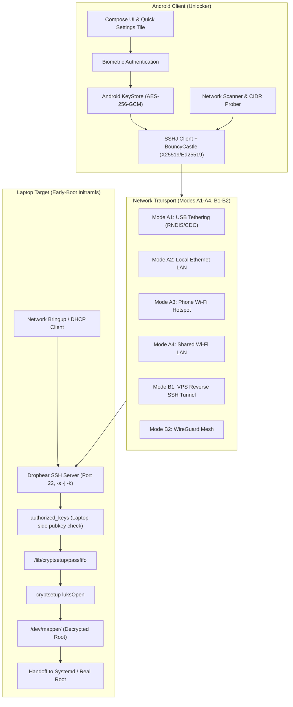
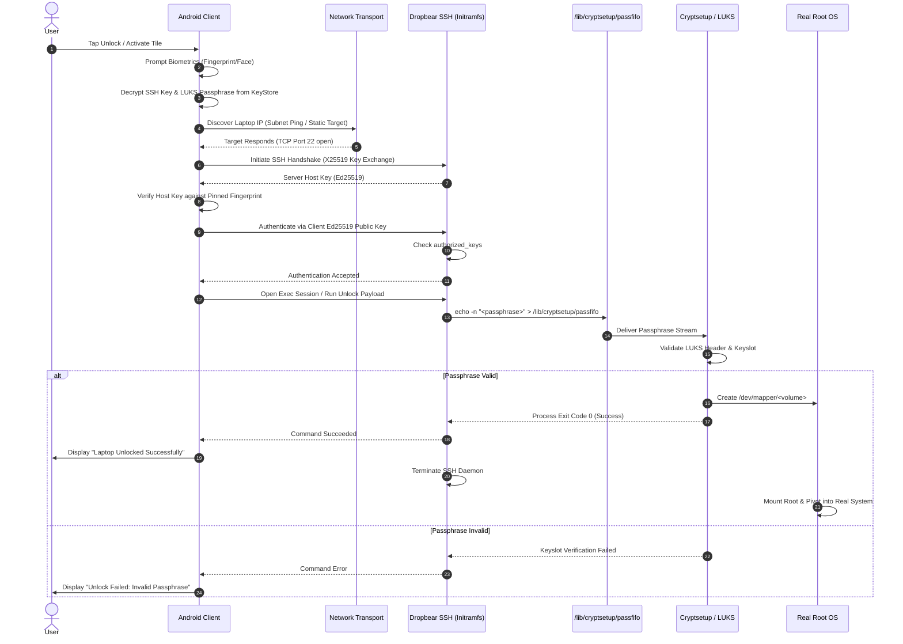

# Architecture Overview: Unlocker

> Architectural specification and system design of Unlocker: early-boot initramfs SSH environment, Android client subsystems, network transport topologies, and secure passfifo disk injection.
>
> Verified: 2026-08-28 — Core architecture validated against QEMU initramfs lab test suite and Android release builds.

## TL;DR

Unlocker bridges an Android smartphone with a LUKS-encrypted laptop during the early-boot stage (`initramfs`). The laptop brings up a minimal network interface and a restricted Dropbear SSH server before the root filesystem is decrypted. The Android app connects via SSH (Ed25519 authentication), verifies the laptop host key, and writes the LUKS passphrase directly into the cryptsetup FIFO queue (`/lib/cryptsetup/passfifo`), triggering automatic partition decryption and system boot handoff.

---

## High-Level System Architecture

---

## Component Breakdown

### 1. Android Application Subsystems
- **Presentation & Quick Controls**: Built with Jetpack Compose. Includes a single-tap Unlock dashboard, target laptop manager, key management interface, and a system Quick Settings Tile (`UnlockTileService`) for zero-interaction unlocking from the notification shade.
- **Biometric Security & Secret Vault**: Secrets (LUKS passphrases and private SSH keys) are stored in `EncryptedSharedPreferences`, hardware-backed by the **Android KeyStore** using AES-256-GCM. Decryption strictly requires user biometric authentication (`BiometricPrompt`).
- **Network Discovery Engine (`NetworkScanner`)**: Scans active subnets dynamically across all network interfaces (USB RNDIS `rndis0`, Wi-Fi `wlan0`, Hotspot `ap0`), calculating CIDR ranges without arbitrary 254-host caps.
- **SSH Transport Engine (`SshUnlockClient`)**: Implements SSH connection management using `SSHJ` with `BouncyCastle` registered as security provider. Enforces Ed25519 host key verification, strict host key pinning, and public key authentication.

### 2. Laptop Early-Boot Subsystems (`initramfs`)
- **Dropbear SSH Daemon**: Minimal embedded SSH daemon compiled for early-boot. Starts before userland services with password authentication permanently disabled (`-s -j -k`).
- **Hardware & Interface Drivers**: Kernel modules for USB Ethernet gadgets (`cdc_ether`, `rndis_host`), physical network cards, and wireless chipsets with microcode firmware hooks (`wpa_supplicant`).
- **Passfifo FIFO Injection**: Interacts with the standard Debian/Ubuntu `cryptsetup-initramfs` named pipe (`/lib/cryptsetup/passfifo`). Writing the newline-terminated passphrase to this FIFO feeds `cryptsetup luksOpen` without human keyboard intervention.

---

## Detailed Unlock Sequence

---

## Security Model & Threat Boundaries

1. **Unencrypted Initramfs Boundary**:
   - The initramfs image in `/boot` is unencrypted.
   - Any secret stored in initramfs (such as Wi-Fi WPA2 pre-shared keys or WireGuard client keys) is considered readable by anyone with physical access to the machine.
   - **Principle**: *No disk encryption keys or private SSH credentials are ever stored in the laptop's initramfs*. The initramfs only contains the *public* key of the authorized phone.
2. **Network Confidentiality**:
   - The LUKS passphrase is never transmitted in plain text. It traverses an encrypted, authenticated SSH tunnel.
   - Dropbear runs strictly with public key authentication; brute-forcing or dictionary attacks over the network are completely prevented.
3. **Android Client Hardening**:
   - Passphrases and private keys are never written to plain log files or world-readable storage.
   - `EncryptedSharedPreferences` ensures secrets remain unreadable on rooted devices without biometric access.
   - Strict host key pinning prevents rogue servers from impersonating the laptop to steal the passphrase.
